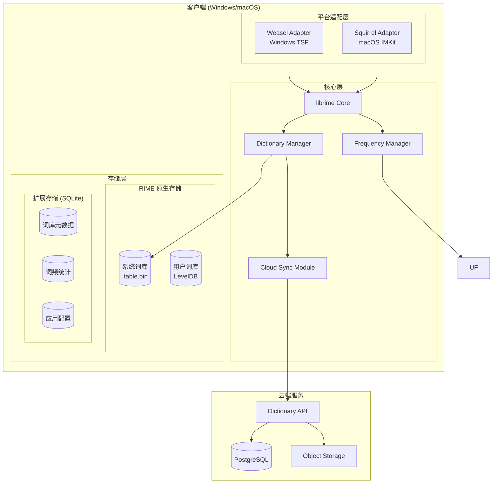

# Design Document: Cross-Platform IME

## Overview

本设计文档描述跨平台中英文输入法的技术架构和实现方案。系统基于 RIME (librime) 开源引擎二次开发，复用其成熟的拼音输入能力，同时扩展云端词库自动更新功能。

### 技术选型

| 组件 | 技术方案 | 说明 |
|------|----------|------|
| 输入法核心 | librime | Fork RIME 引擎，复用拼音解析、候选词生成等核心能力 |
| Windows 前端 | Weasel (小狼毫) | Fork 官方 Windows 实现，基于 TSF 框架 |
| macOS 前端 | Squirrel (鼠须管) | Fork 官方 macOS 实现，基于 Input Method Kit |
| 云端服务 | Go + PostgreSQL | 轻量级词库版本管理和分发服务 |
| 词库格式 | RIME 标准格式 (.dict.yaml) | 兼容 RIME 生态，便于词库迁移 |
| 基础词库 | rime-ice (雾凇拼音) | Apache 2.0 许可，社区活跃维护，词条质量高 |
| 本地扩展存储 | SQLite | 应用扩展数据（词库元数据、词频统计、配置） |

### 词库选型说明

选择 **rime-ice (雾凇拼音)** 作为基础词库：
- 仓库地址：https://github.com/iDvel/rime-ice
- 许可证：Apache 2.0，可商用
- 词条规模：约 80 万词条，覆盖日常用语、网络流行语、专业术语
- 维护状态：社区活跃，持续更新
- 格式兼容：原生 RIME 格式，无需转换

### 设计原则

1. **最小改动原则**：尽量复用 RIME 现有实现，只在必要处扩展
2. **核心共享原则**：输入法核心逻辑跨平台共享，平台特定代码隔离
3. **离线优先原则**：云端服务不可用时，本地功能完全正常

---

## Architecture

### 系统架构图



### 模块职责

| 模块 | 职责 |
|------|------|
| Platform Adapter | 接收系统键盘事件，管理候选词窗口，提交文字到应用 |
| librime Core | 拼音解析、候选词生成、输入状态管理 |
| Dictionary Manager | 词库加载、查询、版本管理 |
| Frequency Manager | 用户词频记录、候选词排序优化 |
| Local Storage | RIME 原生存储（词库、用户词库）+ SQLite 扩展存储 |
| Cloud Sync Module | 词库版本检查、下载、增量更新 |
| Dictionary API | 词库元数据管理、版本查询、下载链接生成 |

---

## Components and Interfaces

### 1. Platform Adapter Interface

平台适配层需要实现的统一接口，供核心层调用：

```cpp
// 平台适配器接口 (C++)
class IPlatformAdapter {
public:
    virtual ~IPlatformAdapter() = default;
    
    // 显示候选词窗口
    virtual void ShowCandidateWindow(
        const CandidateList& candidates,
        const CursorPosition& position
    ) = 0;
    
    // 隐藏候选词窗口
    virtual void HideCandidateWindow() = 0;
    
    // 提交文字到当前应用
    virtual void CommitText(const std::string& text) = 0;
    
    // 更新状态图标
    virtual void UpdateStatusIcon(InputMode mode) = 0;
    
    // 获取当前光标位置
    virtual CursorPosition GetCursorPosition() = 0;
};

// 输入模式枚举
enum class InputMode {
    Chinese,    // 中文模式
    English,    // 英文模式
    Disabled    // 禁用状态
};

// 候选词结构
struct Candidate {
    std::string text;       // 候选词文本
    std::string comment;    // 注释（如拼音）
    int index;              // 序号 (1-9)
};

using CandidateList = std::vector<Candidate>;
```

### 2. Candidate Merge Strategy (候选词合并策略)

为确保用户高频词能够优先展示，系统采用**用户高频词优先注入**的后处理策略，而非修改 librime 内部排序逻辑。

#### 合并流程

```
用户输入拼音 (如 "ni")
         ↓
┌────────────────────────────────────────────────────────┐
│ Step 1: 查询 SQLite 用户高频词                          │
│   SELECT word, pinyin, frequency                       │
│   FROM user_word_frequency                             │
│   WHERE pinyin = 'ni'                                  │
│   ORDER BY frequency DESC                              │
│   LIMIT 5;                                             │
│   → 结果: ["你"(freq:100), "妮"(freq:20), "尼"(freq:5)]│
└────────────────────────────────────────────────────────┘
         ↓
┌────────────────────────────────────────────────────────┐
│ Step 2: 查询 librime 候选词                             │
│   → 结果: ["你", "尼", "泥", "逆", "腻", "倪", ...]     │
│   (按词库基础词频排序)                                  │
└────────────────────────────────────────────────────────┘
         ↓
┌────────────────────────────────────────────────────────┐
│ Step 3: 合并去重                                        │
│   1. 用户高频词放在最前面                               │
│   2. librime 结果去除已存在的词后追加                   │
│   3. 截取前 N 个作为当前页候选词                        │
│   → 最终: ["你", "妮", "尼", "泥", "逆", "腻", ...]     │
└────────────────────────────────────────────────────────┘
```

#### 接口设计

```cpp
// 候选词合并器
class CandidateMerger {
public:
    // 合并用户高频词和 librime 候选词
    // @param userWords 用户高频词列表（已按词频排序）
    // @param rimeCandidates librime 返回的候选词列表
    // @param pageSize 每页显示数量
    // @return 合并后的候选词列表
    static std::vector<CandidateWord> Merge(
        const std::vector<CandidateWord>& userWords,
        const std::vector<CandidateWord>& rimeCandidates,
        int pageSize = 9
    );
};
```

#### 合并规则

1. **用户高频词数量限制**：最多取前 5 个用户高频词注入，避免完全覆盖词库结果
2. **词频阈值**：只有 `frequency >= 3` 的用户词才参与注入，避免偶然输入干扰
3. **去重策略**：以词文本为 key 去重，保留用户高频词的位置
4. **分页处理**：合并后的列表支持分页，翻页时重新计算

#### 性能考量

| 操作 | 预期耗时 | 说明 |
|------|----------|------|
| SQLite 查询用户高频词 | < 1ms | 有索引，查询量小 |
| librime 生成候选词 | 5-20ms | 主要耗时在此 |
| 合并去重 | < 0.5ms | 内存操作，数据量小 |
| **总计** | **< 25ms** | 用户无感知 |

---

### 3. Dictionary Manager Interface

词库管理模块接口：

```cpp
// 词库管理器接口
class IDictionaryManager {
public:
    virtual ~IDictionaryManager() = default;
    
    // 加载词库
    virtual bool LoadDictionary(const std::string& path) = 0;
    
    // 卸载词库
    virtual void UnloadDictionary(const std::string& dictId) = 0;
    
    // 获取已加载词库列表
    virtual std::vector<DictionaryInfo> GetLoadedDictionaries() = 0;
    
    // 检查词库版本
    virtual DictionaryVersion GetLocalVersion(const std::string& dictId) = 0;
    
    // 应用新词库（热更新）
    virtual bool ApplyDictionaryUpdate(
        const std::string& dictId,
        const std::string& newPath
    ) = 0;
};

struct DictionaryInfo {
    std::string id;         // 词库唯一标识
    std::string name;       // 词库名称
    std::string version;    // 版本号
    int64_t wordCount;      // 词条数量
    DictType type;          // 词库类型
};

enum class DictType {
    Base,       // 基础词库
    Extended,   // 扩展词库
    Industry,   // 行业词库
    User        // 用户词库
};
```

### 4. Cloud Sync Interface

云端同步模块接口：

```cpp
// 云端同步接口
class ICloudSync {
public:
    virtual ~ICloudSync() = default;
    
    // 检查更新（异步）
    virtual void CheckForUpdates(
        std::function<void(const std::vector<UpdateInfo>&)> callback
    ) = 0;
    
    // 下载词库（异步）
    virtual void DownloadDictionary(
        const std::string& dictId,
        const std::string& version,
        std::function<void(bool success, const std::string& localPath)> callback
    ) = 0;
    
    // 取消下载
    virtual void CancelDownload(const std::string& dictId) = 0;
    
    // 获取下载进度
    virtual float GetDownloadProgress(const std::string& dictId) = 0;
};

struct UpdateInfo {
    std::string dictId;
    std::string currentVersion;
    std::string latestVersion;
    int64_t downloadSize;       // 下载大小（字节）
    bool isIncremental;         // 是否增量更新
};
```

### 5. Cloud Dictionary Service API

云端词库服务 RESTful API 设计：

```yaml
# 词库版本查询
GET /api/v1/dictionaries
Response:
  - id: string
    name: string
    version: string
    type: base|extended|industry
    size: number
    checksum: string
    updatedAt: timestamp

# 检查更新
POST /api/v1/dictionaries/check-updates
Request:
  dictionaries:
    - id: string
      version: string
Response:
  updates:
    - id: string
      currentVersion: string
      latestVersion: string
      downloadUrl: string
      size: number
      isIncremental: boolean

# 下载词库
GET /api/v1/dictionaries/{id}/download?version={version}
Response: Binary file stream
```

---

## Data Models

### 存储架构

本系统采用混合存储方案，保持与 RIME 的兼容性，同时为扩展功能提供更好的存储支持：

```
┌─────────────────────────────────────────────────────────┐
│                    RIME 原生存储                         │
│  ┌─────────────────────┐  ┌─────────────────────────┐  │
│  │ 系统词库             │  │ 用户词库                 │  │
│  │ .dict.yaml          │  │ LevelDB                 │  │
│  │ → .table.bin        │  │ (RIME 自带)             │  │
│  │ (Marisa Trie)       │  │                         │  │
│  └─────────────────────┘  └─────────────────────────┘  │
└─────────────────────────────────────────────────────────┘
                           +
┌─────────────────────────────────────────────────────────┐
│                  扩展存储 (SQLite)                       │
│  ┌─────────────────────────────────────────────────┐   │
│  │ - 云端词库版本元数据                              │   │
│  │ - 用户词频统计（增强排序）                        │   │
│  │ - 应用配置                                       │   │
│  │ - 下载任务状态                                   │   │
│  └─────────────────────────────────────────────────┘   │
└─────────────────────────────────────────────────────────┘
```

### 1. 词库文件格式（RIME 原生）

沿用 RIME 标准词库格式 (.dict.yaml)：

```yaml
# 词库头部
---
name: pinyin_base
version: "1.0.0"
sort: by_weight
columns:
  - text
  - code
  - weight
...

# 词条数据
中国	zhong guo	99999
中国人	zhong guo ren	88888
你好	ni hao	99998
```

### 2. 本地扩展存储（SQLite Schema）

```sql
-- 本地 SQLite 数据库 Schema
-- 文件位置: {app_data}/ime_data.db

-- 词库元数据表（跟踪本地已安装的词库）
CREATE TABLE local_dictionaries (
    id VARCHAR(64) PRIMARY KEY,
    name VARCHAR(128) NOT NULL,
    type VARCHAR(32) NOT NULL,          -- base, extended, industry
    local_version VARCHAR(32) NOT NULL,
    cloud_version VARCHAR(32),          -- 云端最新版本（可能为空）
    word_count INTEGER NOT NULL,
    file_path VARCHAR(256) NOT NULL,
    checksum VARCHAR(64) NOT NULL,
    priority INTEGER DEFAULT 0,         -- 词库优先级，数值越大优先级越高
    is_enabled BOOLEAN DEFAULT TRUE,
    installed_at TIMESTAMP DEFAULT CURRENT_TIMESTAMP,
    updated_at TIMESTAMP DEFAULT CURRENT_TIMESTAMP
);

-- 用户词频统计表（增强排序用）
CREATE TABLE user_word_frequency (
    id INTEGER PRIMARY KEY AUTOINCREMENT,
    word TEXT NOT NULL,
    pinyin TEXT NOT NULL,
    frequency INTEGER DEFAULT 1,
    last_used_at TIMESTAMP DEFAULT CURRENT_TIMESTAMP,
    created_at TIMESTAMP DEFAULT CURRENT_TIMESTAMP,
    UNIQUE(word, pinyin)
);

-- 用户词频索引
CREATE INDEX idx_word_frequency_pinyin ON user_word_frequency(pinyin);
CREATE INDEX idx_word_frequency_freq ON user_word_frequency(frequency DESC);

-- 下载任务表（支持断点续传）
CREATE TABLE download_tasks (
    id INTEGER PRIMARY KEY AUTOINCREMENT,
    dictionary_id VARCHAR(64) NOT NULL,
    version VARCHAR(32) NOT NULL,
    download_url TEXT NOT NULL,
    total_size INTEGER NOT NULL,
    downloaded_size INTEGER DEFAULT 0,
    temp_file_path VARCHAR(256),
    status VARCHAR(32) DEFAULT 'pending',  -- pending, downloading, paused, completed, failed
    error_message TEXT,
    created_at TIMESTAMP DEFAULT CURRENT_TIMESTAMP,
    updated_at TIMESTAMP DEFAULT CURRENT_TIMESTAMP
);

-- 应用配置表（键值对存储）
CREATE TABLE app_config (
    key VARCHAR(128) PRIMARY KEY,
    value TEXT NOT NULL,
    updated_at TIMESTAMP DEFAULT CURRENT_TIMESTAMP
);

-- 预置配置
INSERT INTO app_config (key, value) VALUES
    ('cloud.enabled', 'true'),
    ('cloud.server_url', 'https://dict.example.com'),
    ('cloud.check_interval', '86400'),
    ('cloud.auto_update', 'true'),
    ('input.default_mode', 'chinese'),
    ('input.page_size', '9');
```

### 3. 云端词库服务数据库（PostgreSQL Schema）

```sql
-- PostgreSQL Schema
CREATE TABLE dictionaries (
    id VARCHAR(64) PRIMARY KEY,
    name VARCHAR(128) NOT NULL,
    type VARCHAR(32) NOT NULL,  -- base, extended, industry
    current_version VARCHAR(32) NOT NULL,
    word_count BIGINT NOT NULL,
    file_size BIGINT NOT NULL,
    checksum VARCHAR(64) NOT NULL,
    storage_path VARCHAR(256) NOT NULL,
    created_at TIMESTAMP DEFAULT NOW(),
    updated_at TIMESTAMP DEFAULT NOW()
);

CREATE TABLE dictionary_versions (
    id SERIAL PRIMARY KEY,
    dictionary_id VARCHAR(64) REFERENCES dictionaries(id),
    version VARCHAR(32) NOT NULL,
    file_size BIGINT NOT NULL,
    checksum VARCHAR(64) NOT NULL,
    storage_path VARCHAR(256) NOT NULL,
    is_incremental BOOLEAN DEFAULT FALSE,
    base_version VARCHAR(32),  -- 增量更新的基准版本
    created_at TIMESTAMP DEFAULT NOW(),
    UNIQUE(dictionary_id, version)
);
```

### 4. Local Storage Interface

本地扩展存储的访问接口：

```cpp
// 本地存储接口
class ILocalStorage {
public:
    virtual ~ILocalStorage() = default;
    
    // 词库元数据操作
    virtual bool SaveDictionaryMeta(const LocalDictionaryMeta& meta) = 0;
    virtual std::optional<LocalDictionaryMeta> GetDictionaryMeta(const std::string& dictId) = 0;
    virtual std::vector<LocalDictionaryMeta> GetAllDictionaries() = 0;
    virtual bool UpdateDictionaryVersion(const std::string& dictId, const std::string& version) = 0;
    
    // 词频操作
    virtual bool IncrementWordFrequency(const std::string& word, const std::string& pinyin) = 0;
    virtual int GetWordFrequency(const std::string& word, const std::string& pinyin) = 0;
    virtual std::vector<WordFrequency> GetTopFrequencyWords(const std::string& pinyin, int limit) = 0;
    
    // 配置操作
    virtual std::string GetConfig(const std::string& key, const std::string& defaultValue = "") = 0;
    virtual bool SetConfig(const std::string& key, const std::string& value) = 0;
    
    // 下载任务操作
    virtual bool SaveDownloadTask(const DownloadTask& task) = 0;
    virtual std::optional<DownloadTask> GetDownloadTask(const std::string& dictId) = 0;
    virtual bool UpdateDownloadProgress(const std::string& dictId, int64_t downloadedSize) = 0;
};

struct LocalDictionaryMeta {
    std::string id;
    std::string name;
    std::string type;
    std::string localVersion;
    std::string cloudVersion;
    int64_t wordCount;
    std::string filePath;
    std::string checksum;
    int priority;
    bool isEnabled;
};

struct WordFrequency {
    std::string word;
    std::string pinyin;
    int frequency;
    int64_t lastUsedAt;
};

struct DownloadTask {
    std::string dictionaryId;
    std::string version;
    std::string downloadUrl;
    int64_t totalSize;
    int64_t downloadedSize;
    std::string tempFilePath;
    std::string status;
};
```

### 5. 应用配置说明

配置项存储在 SQLite 的 `app_config` 表中，以键值对形式管理：

| 配置键 | 默认值 | 说明 |
|--------|--------|------|
| cloud.enabled | true | 是否启用云端同步 |
| cloud.server_url | https://dict.example.com | 云端服务地址 |
| cloud.check_interval | 86400 | 检查更新间隔（秒） |
| cloud.auto_update | true | 是否自动下载更新 |
| input.default_mode | chinese | 默认输入模式 |
| input.page_size | 9 | 候选词每页数量 |

---

## Correctness Properties

*A property is a characteristic or behavior that should hold true across all valid executions of a system-essentially, a formal statement about what the system should do. Properties serve as the bridge between human-readable specifications and machine-verifiable correctness guarantees.*

### Property 1: 拼音解析正确性

*For any* 有效的拼音字符序列（单音节或多音节），IME_Core 解析后应返回非空的候选词列表，且列表中的每个候选词都应与输入拼音匹配。

**Validates: Requirements 1.1, 1.8**

### Property 2: 候选词排序正确性

*For any* 拼音输入返回的候选词列表，列表应按词频降序排列（考虑词库词频和用户词频的加权）。

**Validates: Requirements 1.2**

### Property 3: 候选词选择正确性

*For any* 非空候选词列表和有效的选择索引（1-9 或空格键），选择操作应返回对应索引位置的候选词（空格键返回第一个）。

**Validates: Requirements 1.3, 1.4**

### Property 4: 拼音原文提交

*For any* 拼音输入状态，按下 Enter 键应返回原始拼音字符串，而非候选词。

**Validates: Requirements 1.5**

### Property 5: 输入状态重置

*For any* 非空输入状态，按下 Escape 键后，输入缓冲区应为空，候选词列表应为空。

**Validates: Requirements 1.6**

### Property 6: 退格编辑正确性

*For any* 长度大于 0 的拼音输入，执行 Backspace 操作后，拼音长度应减少 1，且候选词列表应更新为新拼音对应的结果。

**Validates: Requirements 1.7**

### Property 7: 中英文模式切换

*For any* 输入模式状态，执行 Shift 切换后，模式应翻转（中文→英文 或 英文→中文）。在英文模式下，任意键盘输入应直接透传，不产生候选词。

**Validates: Requirements 2.1, 2.2, 2.4**

### Property 8: 临时英文模式

*For any* 中文模式下以大写字母开头的输入序列，系统应进入临时英文模式，输入内容直接透传直到提交完成。

**Validates: Requirements 2.3**

### Property 9: 候选词分页正确性

*For any* 候选词数量超过页大小的查询结果，翻页操作应返回正确的下一页/上一页候选词，且不重复、不遗漏。

**Validates: Requirements 3.2**

### Property 10: 空候选词处理

*For any* 无法匹配任何词条的拼音输入，候选词列表应为空，候选词窗口状态应为隐藏。

**Validates: Requirements 3.4**

### Property 11: 多词库合并查询

*For any* 加载了多个词库的状态和任意拼音查询，返回的候选词应包含所有词库中匹配的词条（去重后）。

**Validates: Requirements 4.4**

### Property 12: 词库优先级

*For any* 在多个词库中都存在的词条，查询结果中该词条的词频应等于最高优先级词库中的词频值。

**Validates: Requirements 4.5**

### Property 13: 词频更新

*For any* 候选词选择操作，选中词在用户词频数据中的频率值应增加。

**Validates: Requirements 5.1**

### Property 14: 用户词频影响排序

*For any* 用户词频数据中频率较高的词，在相同拼音查询中应排在频率较低的词之前。

**Validates: Requirements 5.2**

### Property 15: 词频数据持久化往返

*For any* 用户词频数据，序列化后再反序列化应得到等价的数据结构。

**Validates: Requirements 5.3**

### Property 16: 自动学词

*For any* 连续选择的多个单字形成的词组（如连续选择"中"和"国"），该词组应被添加到用户词库中。

**Validates: Requirements 5.4**

### Property 17: 版本比较触发更新

*For any* 本地词库版本和云端词库版本，当云端版本号大于本地版本号时，应触发下载更新流程。

**Validates: Requirements 6.4**

### Property 18: 离线降级

*For any* 云端服务不可用的情况，本地拼音输入功能应完全正常工作，返回与在线时相同的本地词库查询结果。

**Validates: Requirements 6.6**


---

## Error Handling

### 1. 输入处理错误

| 错误场景 | 处理策略 |
|----------|----------|
| 无效拼音序列 | 返回空候选词列表，不显示候选窗口 |
| 候选词索引越界 | 忽略操作，保持当前状态 |
| 词库文件损坏 | 跳过损坏词库，记录错误日志，使用其他可用词库 |

### 2. 词库管理错误

| 错误场景 | 处理策略 |
|----------|----------|
| 词库文件不存在 | 记录警告，继续加载其他词库 |
| 词库格式错误 | 跳过错误词条，记录错误位置，继续解析 |
| 词库加载内存不足 | 返回加载失败，提示用户减少词库数量 |

### 3. 云端同步错误

| 错误场景 | 处理策略 |
|----------|----------|
| 网络连接失败 | 静默失败，使用本地词库，下次启动重试 |
| 下载中断 | 支持断点续传，保留已下载部分 |
| 校验和不匹配 | 删除下载文件，重新下载 |
| 服务端返回错误 | 记录错误，延迟重试（指数退避） |

### 4. 平台适配错误

| 错误场景 | 处理策略 |
|----------|----------|
| 系统 API 调用失败 | 记录错误，尝试降级处理 |
| 候选窗口创建失败 | 回退到无窗口模式（仅提交第一候选词） |
| 文字提交失败 | 重试一次，失败则记录错误 |

---

## Testing Strategy

### 测试框架选择

| 测试类型 | 框架 | 说明 |
|----------|------|------|
| C++ 单元测试 | Google Test | librime 核心逻辑测试 |
| C++ 属性测试 | RapidCheck | 基于属性的测试，验证正确性属性 |
| API 集成测试 | Go testing + httptest | 云端服务 API 测试 |
| 端到端测试 | 手动测试 + 自动化脚本 | 平台集成测试 |

### 测试分层

```
┌─────────────────────────────────────┐
│         端到端测试 (E2E)             │  ← 平台集成，手动为主
├─────────────────────────────────────┤
│         集成测试                     │  ← API、词库加载
├─────────────────────────────────────┤
│    属性测试 (Property-Based)         │  ← 核心逻辑正确性
├─────────────────────────────────────┤
│         单元测试                     │  ← 函数级别
└─────────────────────────────────────┘
```

### 属性测试配置

- 每个属性测试运行 **100+ 次迭代**
- 使用 RapidCheck 生成随机输入
- 每个测试标注对应的设计属性编号

```cpp
// 示例：Property 1 测试
RC_GTEST_PROP(PinyinParser, ValidPinyinReturnsNonEmptyCandidates, ()) {
    // Feature: cross-platform-ime, Property 1: 拼音解析正确性
    auto pinyin = *rc::gen::element("ni", "hao", "zhong", "guo", "nihao", "zhongguo");
    auto candidates = ime_core.parse(pinyin);
    RC_ASSERT(!candidates.empty());
    for (const auto& c : candidates) {
        RC_ASSERT(matchesPinyin(c.text, pinyin));
    }
}
```

### 单元测试覆盖

单元测试聚焦于：
- 边界条件（空输入、超长输入）
- 错误处理路径
- 特定已知 bug 的回归测试

### 测试数据

- 使用精简的测试词库（约 1000 词条）
- 覆盖常见拼音组合
- 包含边界情况（多音字、模糊音等）
